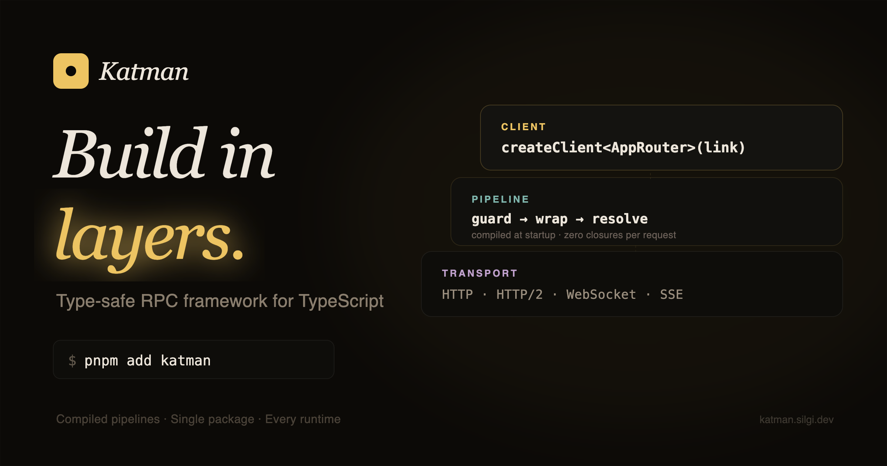

<p align="center">
  <br>
  
  <br><br>
  <a href="https://npmjs.com/package/silgi"></a>
  <a href="https://npmjs.com/package/silgi"></a>
  <a href="https://github.com/productdevbook/silgi/actions/workflows/ci.yml"></a>
  <a href="https://github.com/productdevbook/silgi/blob/main/LICENSE"></a>
</p>

## Quick Start

```bash
npm install silgi
```

```ts
import { silgi } from 'silgi'
import { z } from 'zod'

const s = silgi({ context: (req) => ({ db: getDB() }) })

const appRouter = s.router({
  users: {
    list: k
      .$input(z.object({ limit: z.number().optional() }))
      .$resolve(({ input, ctx }) => ctx.db.users.find({ take: input.limit })),
  },
})

s.serve(appRouter, { port: 3000, scalar: true })
```

## Features

- **Single package** — server, client, 15 plugins, 14 adapters. One install.
- **Compiled pipeline** — guards unrolled, handlers pre-linked at startup.
- **Guard / Wrap** — guards enrich context (flat, sync fast-path). Wraps run before + after (onion).
- **Content negotiation** — JSON, MessagePack, devalue. Automatic from `Accept` header.
- **Contract-first** — define API shape, share types, implement separately.
- **Standard Schema** — Zod, Valibot, ArkType.

## Adapters

| | Import |
|---|---|
| Standalone | `s.serve()` / `s.handler()` |
| Nitro v3 | `serverEntry` + `s.handler()` |
| Express | `silgi/express` |
| Fastify | `silgi/fastify` |
| Elysia | `silgi/elysia` |
| Next.js | `silgi/nextjs` |
| Nuxt | via Nitro `serverEntry` |
| SvelteKit | `silgi/sveltekit` |
| Remix | `silgi/remix` |
| Astro | `silgi/astro` |
| SolidStart | `silgi/solidstart` |
| NestJS | `silgi/nestjs` |
| AWS Lambda | `silgi/aws-lambda` |
| MessagePort | `silgi/message-port` |

## Ecosystem

Built-in re-exports — no extra dependencies needed:

| Import | Package | Use case |
|---|---|---|
| `silgi/unstorage` | unstorage | Key-value storage (Redis, KV, S3) |
| `silgi/ocache` | ocache | Cached functions with TTL + SWR |
| `silgi/ofetch` | ofetch | Universal fetch with auto-retry |
| `silgi/srvx` | srvx | Universal server (Node, Deno, Bun) |

## Integrations

- **TanStack Query** — `queryOptions`, `mutationOptions`, `infiniteOptions`, `skipToken`
- **React Server Actions** — `createAction`, `useServerAction`, `useOptimisticServerAction`
- **AI SDK** — `routerToTools()` turns procedures into LLM tools
- **tRPC Interop** — `fromTRPC()` for incremental migration

## Examples

```bash
npx giget@latest gh:productdevbook/silgi/examples/standalone my-app
npx giget@latest gh:productdevbook/silgi/examples/nextjs my-nextjs-app
npx giget@latest gh:productdevbook/silgi/examples/nuxt my-nuxt-app
```

10 examples: standalone, bun, express, elysia, nitro, nitro-h3, nextjs, nuxt, sveltekit, client-react.

## Documentation

[silgi.dev](https://silgi.dev)

## Credits

- [oRPC](https://github.com/unnoq/orpc) — Pipeline architecture, client proxy, error handling, contract-first workflow
- [tRPC](https://github.com/trpc/trpc) — Router/procedure model, end-to-end type inference
- [Elysia](https://github.com/elysiajs/elysia) — Sucrose-style static handler analysis


## License

MIT
